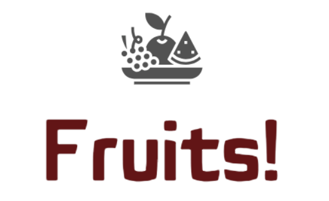

# Deploy a model in the cloud
You are a Data Scientist in a very young AgriTech start-up, called "Fruits!", which seeks to offer innovative solutions for fruit harvesting.

The company's desire is to preserve fruit biodiversity by allowing specific treatments for each fruit species by developing intelligent picking robots.

Your start-up initially wants to make itself known by making available to the general public a mobile application that would allow users to take a picture of
a fruit and obtain information on this fruit.

For the start-up, this application would make the general public aware of fruit biodiversity and set up a first version of the fruit image classification engine.

In addition, the development of the mobile application will make it possible to build a first version of the necessary Big Data architecture.

### Data
A dataset made up of fruit images and associated labels: https://www.kaggle.com/datasets/moltean/fruits
which can be used as a starting point to build part of the data processing chain.

## Your mission
You are therefore responsible for developing in a Big Data environment an initial data processing chain which will include preprocessing and a dimension reduction step.

### Constraints
During his initial brief, Paul warned you of the following points:

You will have to take into account in your developments the fact that the volume of data will increase very quickly after the delivery of this project. 
You will therefore develop scripts in Pyspark and use, for example, the AWS cloud to take advantage of a Big Data architecture (EC2, S3, IAM), based on an EC2 Linux server.
The implementation of a Big Data architecture under (for example) AWS may require a more powerful server configuration than that offered free of charge (EC2 = t2.micro, 1 GB RAM, 8 GB server disk)
